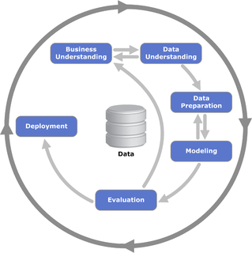

# Product Bundle Analysis and Recommendation

## Introduction
Product Bundle Analysis & Recommendation (PBAR) will be following the CRISP-DM (Cross Industry Standard Process for Data Mining) methodology, which provides a structured approach to planning a data mining project. CRISP-DM outlines a 6-phase iterative framework which are namely – Business Understanding, Data Understanding/Exploration, Data Preparation, Modelling, Evaluation, and Deployment. 

## Purpose of Project
PBAR will involve the incorporation of data from existing company transaction in order to create a personalised recommendation system that can aid in the Relationship Manager’s decision making for the additional products that should be cross-sell to the customers. 

PBAR consists of both Business and Data Mining objective.

### Business Understanding Objectives
On a business perspective, PBAR will be following one of the key marketing strategies known as “what customers like you also bought” in order to give the customers a sense of belonging to the bank. 

### Data Mining Objectives
On a data mining perspective, this marketing strategy will be supported using the Market Basket Analysis to determine what products customers with a similar profile have purchased, before making this recommendation to the relevant customers. 

## What to expect in this project?

